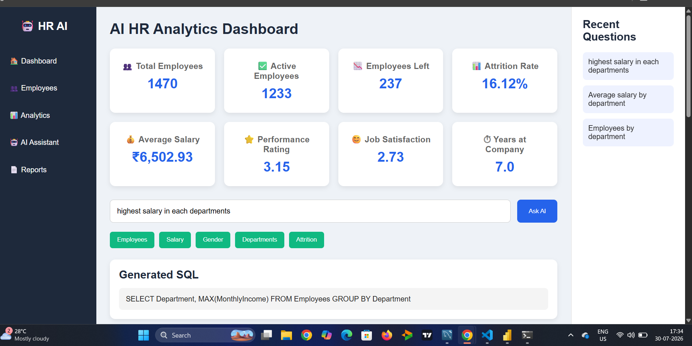
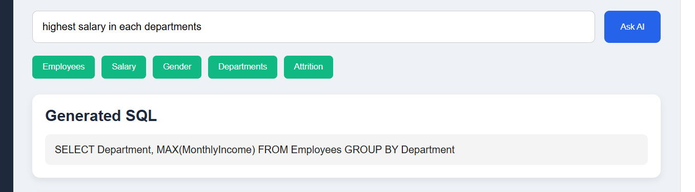
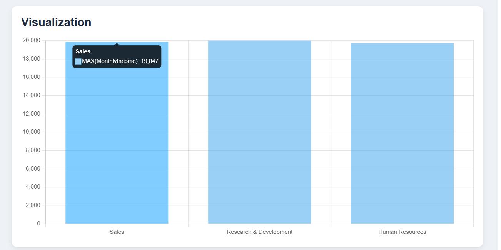
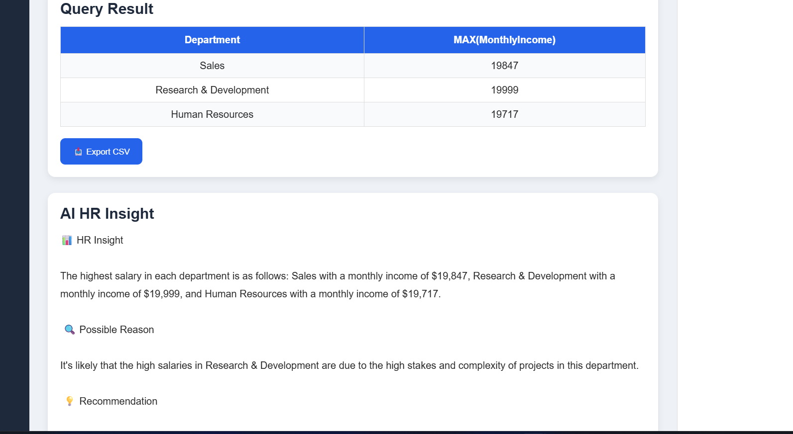

# 🤖 AI HR Analytics Dashboard

An AI-powered HR Analytics Dashboard that enables HR professionals to ask business questions in natural language. The application converts user queries into SQL using Ollama, executes them on a MySQL database, visualizes the results using Chart.js, and generates AI-driven HR insights.

---

# 🚀 Features

- 🤖 AI-powered Natural Language to SQL
- 🗄️ MySQL Database Integration
- 📊 Interactive HR Dashboard
- 📈 Automatic Data Visualization
- 💡 AI-generated HR Insights
- 📋 SQL Query Display
- 📥 Export Results to CSV
- 📱 Responsive User Interface
- 📌 Recent Question History

---

# 📸 Screenshots

## Dashboard



---

## AI Generated SQL



---

## Visualization



---

## AI Insight



---

# 🛠️ Tech Stack

### Backend
- Python
- Flask

### Database
- MySQL

### AI
- Ollama
- Llama 3.2

### Frontend
- HTML
- CSS
- JavaScript
- Chart.js

---

# 📂 Project Structure

```text
AI-HR-Analytics/
│
├── app.py
├── sql_generator.py
├── sql_executor.py
├── insight_generator.py
├── utils.py
├── requirements.txt
│
├── static/
│   ├── style.css
│   └── script.js
│
├── templates/
│   └── index.html
│
└── Screenshots/
    ├── dashboard.png
    ├── sql.png
    ├── chart.png
    └── insight.png
```

---

# ⚙️ Installation

### Clone Repository

```bash
git clone https://github.com/gokulraj-333/AI-HR-Analytics.git
```

```bash
cd AI-HR-Analytics
```

### Install Requirements

```bash
pip install -r requirements.txt
```

### Start Ollama

```bash
ollama serve
```

### Pull Model

```bash
ollama pull llama3.2:3b
```

### Configure Database

Update the MySQL credentials inside:

```
sql_executor.py
```

### Run Application

```bash
python app.py
```

Open:

```
http://127.0.0.1:5000
```

---

# 💬 Example Questions

- Show average salary by department.
- Employees by department.
- Attrition by department.
- Gender distribution.
- Top 10 highest-paid employees.
- Employees working overtime.
- Job satisfaction by department.
- Performance rating by department.

---

# 📊 Dashboard KPIs

- Total Employees
- Active Employees
- Employees Left
- Attrition Rate
- Average Salary
- Performance Rating
- Job Satisfaction
- Average Years at Company

---

# 💡 How It Works

1. User asks an HR question.
2. Ollama converts it into SQL.
3. Flask executes the SQL query.
4. Results are retrieved from MySQL.
5. Chart.js visualizes the data.
6. Ollama generates HR insights.

---

# 🎯 Skills Demonstrated

- Python
- Flask
- SQL
- MySQL
- REST API
- Prompt Engineering
- AI Integration
- Data Visualization
- Dashboard Development
- Business Analytics

---

# 🔮 Future Improvements

- Excel Export
- PDF Reports
- Authentication
- Dashboard Filters
- Multiple Chart Types
- Cloud Deployment

---

# 👨‍💻 Author

**Gokul Raj R S**

GitHub: https://github.com/gokulraj-333

---

# ⭐ If you like this project

Please consider giving it a ⭐ on GitHub.